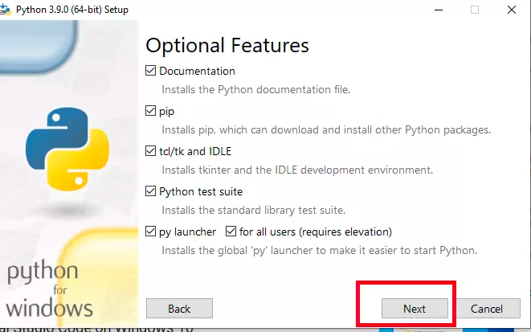
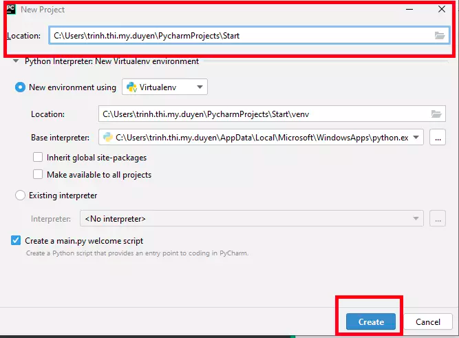

# Robot Framework

## Điều kiện phần mềm cài đặt tiên quyết

- Cài đặt Python
- Cài đặt pip
- Cấu hình PATH (Add Python và PIP đến PATH)
- Sử dụng PIP để cài đặt Robot Framework
- Sử dụng PIP để cài đặt SeleniumLibrary
- Cài đặt Pycharm IDE và Intellbot plugin
- Download Selenium Browserdeivers cho trình duyệt

## Cài đặt Python

### 1: Bên dưới đây tôi sẽ hướng dẫn cài đặt Python trên Win.

#### Bước 1:

Kiểm tra xem trong máy tính của bạn đã cài đặt Python hay chưa?

Mở CMD và gõ lệnh sau:

```python --version```

Nếu bạn đã cài đặt Python trước đó thì sẽ hiển thị phiên bản Python của bạn.

Nếu bạn chưa cài đặt Python thì sẽ hiển thị lỗi như sau:

```'python' is not recognized as an internal or external command, operable program or batch file.```

#### Bước 2: Gỡ cài đặt và cài lại

Nếu bạn đã cài đặt Python trước đó thì bạn cần gỡ cài đặt Python và cài lại.


#### Bước 3: Cài đặt Python

Tải Python tại đây: https://www.python.org/downloads/





#### Setup đường dẫn


#### Bước 4: Kiểm tra xem Python cài đặt xong chưa

Mở CMD và gõ lệnh sau:

```python --version```

Nếu bạn đã cài đặt Python thành công thì sẽ hiển thị phiên bản Python của bạn.

#### Bước 5: Kiểm tra xem Python thuộc thư mục nào


### 1.2.3. Cài đặt PIP
- PIP là một trình quản lý thư viện cho Python, viết tắt của từ Preferred Installer Program. Đây là một tiện ích dòng lệnh cho phép bạn cài đặt, cài đặt lại hoặc gỡ cài đặt các gói PyPI bằng một dòng lệnh đơn giản và dễ hiểu: pip.

#### a. Kiểm tra Python đã cài đúng chưa

- Để sử dụng PIP, bạn phải chắc chắn rằng Python của mình đã được cài đặt chính xác trên thiết bị của mình.

- Trên Win mở Command Prompt -> và chọn Command Prompt -> Sau đó gõ:

- ```python --version```


#### b. Cài đặt PIP

- Để cài đặt PIP, bạn có thể sử dụng lệnh sau:
- ```python -m pip install --upgrade pip```
- Nếu bạn đã cài đặt PIP thành công thì sẽ hiển thị phiên bản PIP của bạn.
- ```pip 20.2.3 from c:\users\administrator\appdata\local\programs\python\python38\lib\site-packages\pip (python 3.8)```
- Nếu bạn chưa cài đặt PIP thì sẽ hiển thị lỗi như sau:
- ```'python' is not recognized as an internal or external command, operable program or batch file.```


### 1.2.4. Sử dụng PIP để cài đặt Robot Framework
- Để cài đặt Robot Framework, bạn có thể sử dụng lệnh sau:
- ```pip install robotframework```
- Nếu bạn đã cài đặt Robot Framework thành công thì sẽ hiển thị phiên bản Robot Framework của bạn.
- ```robotframework 3.2.2```
- Nếu bạn chưa cài đặt Robot Framework thì sẽ hiển thị lỗi như sau:
- 
- ```'pip' is not recognized as an internal or external command, operable program or batch file.```
- Kiểm tra xem robotframework đã được cài đặt đúng chưa bằng câu lệnh: ``` pip list ```


### 1.2.5. Sử dụng PIP để cài đặt SeleniumLibrary
- Tại cửa sổ Command promt, dùng lệnh:
- ```pip install robotframework-seleniumlibrary```
- Sau khi cài đặt thành công sẽ có thông báo như sau:


### 1.2.6. Cài đặt Pycharm IDE và Intellbot plugin
- Pycharm là một trình soạn thảo mã nguồn mở, được phát triển bởi JetBrains. Nó được sử dụng để phát triển các ứng dụng bằng Python, Java, JavaScript, TypeScript, CSS, HTML, PHP, C#, C++, Go, Dart, Kotlin, và SQL. PyCharm được phát hành theo giấy phép Apache 2.0.
- Các tính năng chính của PyCharm bao gồm:
- Hỗ trợ cho các ngôn ngữ lập trình Python, JavaScript, TypeScript, CSS, HTML, PHP, C#, C++, Go, Dart, Kotlin, và SQL.
- Tải Pycharm IDE từ đây:
- https://www.jetbrains.com/pycharm/download/#section=windows

- Sau khi tải xong, bạn cần cài đặt Pycharm IDE như bình thường.





### 2: Bên dưới đây tôi sẽ hướng dẫn cài đặt Python trên Mac.
### 2.1. Cài đặt Python trên Mac
- Để cài đặt Python trên Mac, bạn có thể sử dụng lệnh sau:
- ```brew install python```
- Nếu bạn đã cài đặt Python thành công thì sẽ hiển thị phiên bản Python của bạn.
- ```Python 3.8.5```
- Nếu bạn chưa cài đặt Python thì sẽ hiển thị lỗi như sau:
- ```'brew' is not recognized as an internal or external command, operable program or batch file.```
- Kiểm tra xem Python đã được cài đặt đúng chưa bằng câu lệnh: ``` python --version ```
### 2.2. Cài đặt PIP trên Mac
- Để cài đặt PIP trên Mac, bạn có thể sử dụng lệnh sau:
- ```brew install pip```
- Nếu bạn đã cài đặt PIP thành công thì sẽ hiển thị phiên bản PIP của bạn.
- ```pip 20.2.4```
- Nếu bạn chưa cài đặt PIP thì sẽ hiển thị lỗi như sau:
- ```'brew' is not recognized as an internal or external command, operable program or batch file.```
- Kiểm tra xem PIP đã được cài đặt đúng chưa bằng câu lệnh: ``` pip --version ```

### 2.3. Cài đặt Robot Framework trên Mac
- Để cài đặt Robot Framework trên Mac, bạn có thể sử dụng lệnh sau:
- ```pip install robotframework```
- Nếu bạn đã cài đặt Robot Framework thành công thì sẽ hiển thị phiên bản Robot Framework của bạn.
- ```Robot Framework 3.2.2 (Python 3.8.5 on darwin)```
- Nếu bạn chưa cài đặt Robot Framework thì sẽ hiển thị lỗi như sau:
- ```'pip' is not recognized as an internal or external command, operable program or batch file.```
- Kiểm tra xem Robot Framework đã được cài đặt đúng chưa bằng câu lệnh: ``` robot --version ```
- Nếu bạn muốn cài đặt phiên bản cụ thể của Robot Framework thì bạn có thể sử dụng lệnh sau:
- ```pip install robotframework==3.2.2```
- Nếu bạn muốn cài đặt phiên bản mới nhất của Robot Framework thì bạn có thể sử dụng lệnh sau:
- ```pip install robotframework --upgrade```
- Nếu bạn muốn cài đặt phiên bản cụ thể của Robot Framework thì bạn có thể sử dụng lệnh sau:
- ```pip install robotframework==3.2.2 --upgrade```

### 2.4. Cài đặt Pycharm IDE trên Mac
- Tải Pycharm IDE từ đây:
- https://www.jetbrains.com/pycharm/download/#section=mac
- Sau khi tải xong, bạn cần cài đặt Pycharm IDE như bình thường.
### 2.5. Cài đặt Selenium Library trên Mac
- Để cài đặt Selenium Library trên Mac, bạn có thể sử dụng lệnh sau:
- ```pip install robotframework-seleniumlibrary```
- Nếu bạn đã cài đặt Selenium Library thành công thì sẽ hiển thị phiên bản Selenium Library của bạn.
- ```robotframework-seleniumlibrary 5.1.3```
- Nếu bạn chưa cài đặt Selenium Library thì sẽ hiển thị lỗi như sau:
- ```'pip' is not recognized as an internal or external command, operable program or batch file.```
- Kiểm tra xem Selenium Library đã được cài đặt đúng chưa bằng câu lệnh: ``` pip show robotframework-seleniumlibrary ```
- Nếu bạn muốn cài đặt phiên bản cụ thể của Selenium Library thì bạn có thể sử dụng lệnh sau:
- ```pip install robotframework-seleniumlibrary==5.1.3```
### 2.6: Cài đặt selenium và robotselenium plugin trên Pycharm IDE
- Để cài đặt selenium và robotselenium plugin trên Pycharm IDE, bạn có thể sử dụng lệnh sau:
- ```pip install robotframework-seleniumlibrary```
- Nếu bạn đã cài đặt selenium và robotselenium plugin thành công thì sẽ hiển thị phiên bản selenium và robotselenium plugin của bạn.
- ```robotframework-seleniumlibrary 5.1.3```
- Nếu bạn chưa cài đặt selenium và robotselenium plugin thì sẽ hiển thị lỗi như sau:
- ```'pip' is not recognized as an internal or external command, operable program or batch file.```
- Kiểm tra xem selenium và robotselenium plugin đã được cài đặt đúng chưa bằng câu lệnh: ``` pip show robotframework-seleniumlibrary ```
- Nếu bạn muốn cài đặt phiên bản cụ thể của selenium và robotselenium plugin thì bạn có thể sử dụng lệnh sau:
- ```pip install robotframework-seleniumlibrary==5.1.3```
- Bạn có thể tham khảo thêm tại đây:
- https://plugins.jetbrains.com/plugin/10036-robot-framework-support


